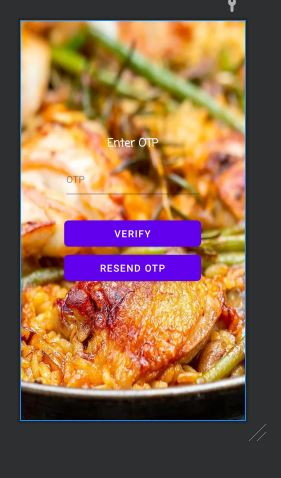
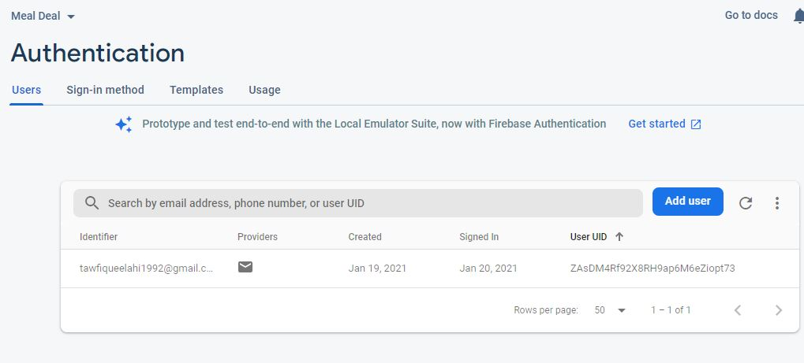

**Introduction:**

You never go wrong with homecooked food. 

With Meal Deal, you can order fresh and hygienic homecooked food, whatever and whenever you want. If you love cooking and want to make money selling your food, Meal Deal is the right choice for you as well!

If you got some free time and wondering what to do, don’t worry, we got your back. With Meal Deal, you can sign up as a delivery boy and start delivering food in your area.

**Features:**

*   Login/Register as Chef, Customer, or Delivery Boy
*   Login with Email, and Phone
*   OTP Verification
*   Upload Product as Chef
*   Update profile as Chef and Customer
*   Cart for Customer
*   Track Orders as Customer

**Snapshots:**

**Data Management:**

I used Firebase for Real-time database, cloud storage, and authentication. 

**Snapshots:**

		Figure: Firebase used for Realtime Database, Authentication, and Storage

**Design Pattern:**

I adopted MVC architecture on the client-side. However, in order to enhance the overall infrastructure, I used Singleton. For example, I choose Singleton Pattern to implement Fragment and Authentication.

**Roadblocks:**

**UI/UX:** The first challenge I encountered was Android's multi-screen size and ratio. There is a major drawback with importing the UI from Figma. The Android code generated by Figma is not sufficient to be implemented in the real application. 'Drawble' export doesn't fix the problem. I had to use default drawables to solve this problem.

**Firebase:** The next issue I faced was with Firebase authentication. At times, the application couldn’t fetch data from the real-time database. Moreover, in the upload product page on Chef’s end, I initially confronted a problem that displayed that the attempt of uploading the product to Firebase wasn’t successful, later on, I could solve this problem by changing the dependencies.

**Android Emulator**: Android emulator occupies a lot of memory space, and makes the device slower. After a certain amount of time, the emulator will display a 'System UI' dialog box to stop running. I had to spend several hours debugging my code and later I discovered that the error worked perfectly on the phone, but it was crashing on the emulator.   
